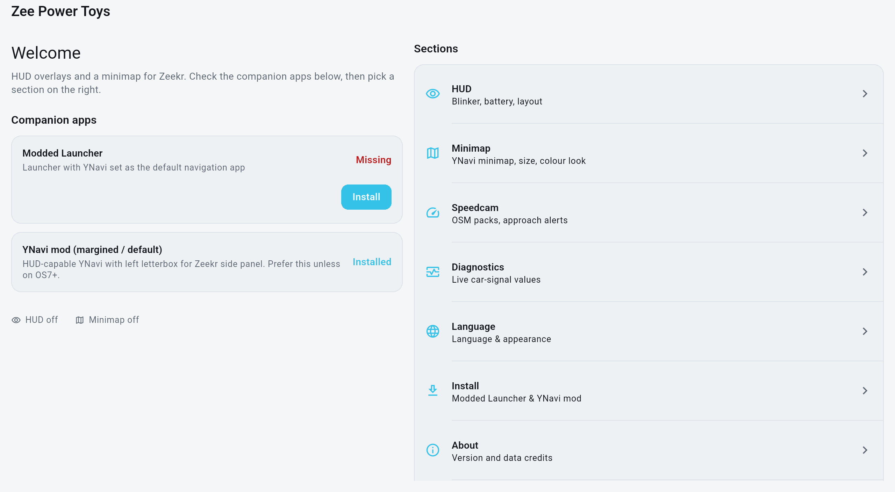
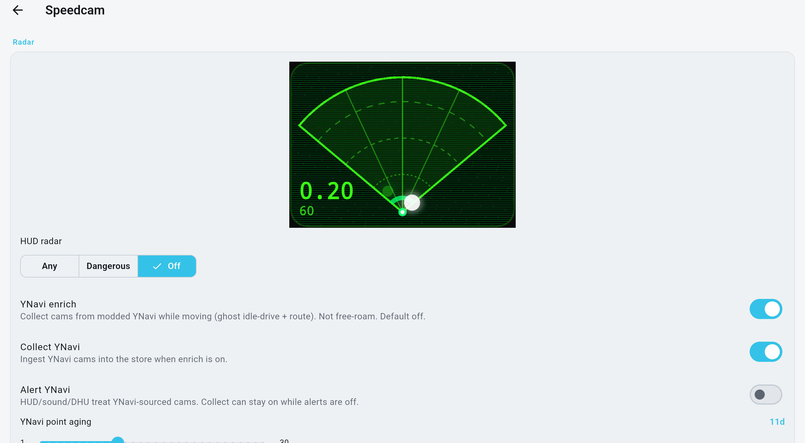
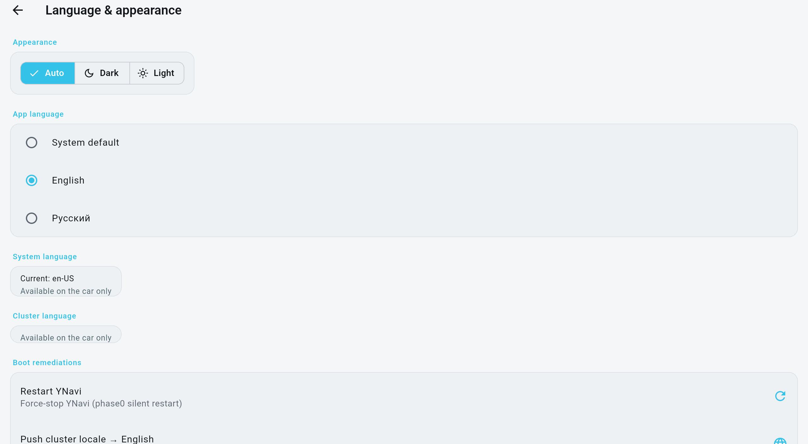

# Zee Power Toys

**[EN](README.md) | [RU](README_RU.md)**

**Windshield HUD + DHU utilities for Zeekr Android head units.**


Windshield HUD projection:
- YNavi navigation minimap
- blinkers
- speed-camera alerts
- battery charge level and temperature

Also:
- set the instrument-cluster language to English
- change language on the tablet
- switch USB between host and peripheral (wired connect + ADB)
- quick download/install buttons for companions (Launcher with YNavi, YNavi)

| Companions | |
|---|---|
| **YNavi mod (needed for projection, larger scale)** | [maxim-saplin/ynavi-zee](https://github.com/maxim-saplin/ynavi-zee) |
| **Launcher mod (replaces Chinese nav with YNavi)** | [maxim-saplin/zeekr_apk_mod](https://github.com/maxim-saplin/zeekr_apk_mod) |

---


## Support

| | |
|---|---|
| **Tested** | **Zeekr 007**, Zeekr OS **6.7** |
| **Expected** | **Zeekr 001**, software **6.3+** |

Honest split: we dogfood on 007 / 6.7. 001 and 6.3+ should work the same DHU stack, but we have not signed those off as tested.

## Quick start

### A. Install on the DHU (no PC)

1. On the car tablet, open the [Releases](https://github.com/maxim-saplin/zee-power-toys/releases) page (browser) and download **`zee-power-toys.apk`** from the latest tag (`MAJOR.MINOR.PATCH+BUILD` (e.g. `1.1.0+11`)).
2. Open the downloaded APK (Files / Downloads) and install with the system installer.
3. If Android blocks it: allow **install from this source** (browser / Files) when prompted — normal for sideloads.
4. Open **Zee Power Toys**. Grant **location** when Speedcam asks (runtime dialog — not an install-time permission).
5. Optional: companions via in-app **Install** (YNavi / Launcher from their Releases). Self-update later: **Install → Check for updates**.

**Permissions that can need an extra UI tap (not CLI):**
- **Location** — in-app dialog the first time Speedcam needs it.
- **Display over other apps** (`SYSTEM_ALERT_WINDOW`) — only if you enable the DHU Speedcam system overlay; Android opens a Settings screen to allow it.
- Unknown-sources / “install unknown apps” — once per installer app (browser/Files).

Day-to-day: never uninstall to “refresh” — it wipes prefs. Prefer replace/update installs. See [0054](docs/issues/0054-settings-survive-reinstall.md).

### B. Install from a workstation (`adb`)

1. On a PC/Mac, download **`zee-power-toys.apk`** from [Releases](https://github.com/maxim-saplin/zee-power-toys/releases).
2. On the DHU: Engineering menu (bright orange button at top center — tap ~10 times) → set ADB to **Peripheral**, then USB-connect the car to the workstation.
3. Install [Android Platform Tools](https://developer.android.com/tools/releases/platform-tools) so `adb` is on your `PATH`.
4. Confirm the device and install (keep data):

```bash
adb devices
adb install -g -r -d zee-power-toys.apk
```

`-g` grants runtime permissions where the platform allows; you may still get the location / overlay prompts above.

### Self-update (already installed)

- Latest asset: `zee-power-toys.apk` on tag `MAJOR.MINOR.PATCH+BUILD` (e.g. `1.1.0+11`)
- In-app: **Install → Check for updates → Update now**


## What you get

- **HUD** — blinkers, battery/charge, Safe-Area layout, Config Preview  
- **Minimap** — YNavi on the windshield (needs YNavi mod; usually Launcher too)  
- **Speedcam** — OSM packs, approach alerts, Default/Alien looks, Demo on HUD  
  **Does not require YNavi** — packs alone are enough  
- **DHU** — language/cluster, Install companions, diagnostics, USB/ADB helpers  
- **Self-update** — public GitHub Releases → PackageInstaller  

---

## Quick overview

DHU settings app (Tablet / car head unit). Switch language under **Language**.

### 1. Home

Companion install status on the left; open **HUD**, **Minimap**, **Speedcam**, and the rest from **Sections** on the right.



### 2. Speedcam

OSM packs, approach alerts, Alien/Default radar look, and optional YNavi enrich/collect. Speedcam works without YNavi.



### 3. Language & appearance

Switch the app UI between English and Russian (and theme). System/cluster language controls are for the car when available.




---

## Companion APKs

Optional for Speedcam; required for minimap / default-nav integration.

| Companion | Repo | Release |
|-----------|------|----------------|
| YNavi margined (default) | [ynavi-zee](https://github.com/maxim-saplin/ynavi-zee) | tag `ynavi-zeekr-v27.0.2` / `zeekr_v27.0.2_margined.apk` (upstream YNavi 27.0.2) |
| YNavi OS7+ (no left margin) | same | same tag / `zeekr_v27.0.2_os7_nomargin.apk` |
| Zeekr Launcher mod | [zeekr_apk_mod](https://github.com/maxim-saplin/zeekr_apk_mod) | tag `launcher-670` / `XCLauncher3-670-yandex-signed.apk` |

**Install UI** downloads Release assets and runs `PackageInstaller`.  
**Location** is runtime (in-app dialog) — not install-time. `adb pm grant` is lab-only.


---

## Versioning

`pubspec.yaml`: **`MAJOR.MINOR.PATCH+BUILD`** (from `1.0.0+1`).  
Bump `+BUILD` on every tip/car APK; bump semver for user-facing releases.  
Version from `pubspec.yaml` via PackageInfo. See [CHANGELOG.md](CHANGELOG.md).

---

## Credits

**Speedcam** locations from [OpenStreetMap](https://www.openstreetmap.org/)
(© OpenStreetMap contributors), [ODbL](https://opendatacommons.org/licenses/odbl/).

---

## For contributors

Domain glossary: [`CONTEXT.md`](CONTEXT.md) · Requirements: [`REQUIREMENTS.md`](REQUIREMENTS.md) · ADRs: [`docs/adr/`](docs/adr/) · Blocks: [`docs/issues/`](docs/issues/).


### Release signing / CI

Local / car APKs use the **committed** AOSP platform debug keystore:

| | |
|---|---|
| **Keystore** | `android/tools/zeekr/androiddebugkey.jks` |
| **Alias / pass** | from `android/gradle.properties` |
| **Build** | `flutter build apk --release -PuseAospDebugKey=true` |
| **Install** | `adb install -g -r -d build/app/outputs/flutter-apk/app-release.apk` |
| **Publish** | tag `MAJOR.MINOR.PATCH+BUILD` (e.g. `1.1.0+11`) (or Actions → **release** → `workflow_dispatch`) → `release.yml` uploads `zee-power-toys.apk` |
| **Push CI** | `ci.yml` on `main`: analyze + test only |

Details: [docs/publish/ci-release.md](docs/publish/ci-release.md).

### Desktop bring-up (T1)

```bash
uv run dev/zee_run.py up    # Linux (or macOS with macos/ runner)
```

T1 uses fakes for minimap — use T2 emulator / T3 car for YNavi surface.

### T2 emulator (DHU-matched)

T2 needs a **tablet** AVD on **Android 12L (API 32)** at roughly **DHU resolution** (landscape ~2560×1600), not a phone skin. Prefer `-gpu host` and a cold boot (`-no-snapshot-load`) if the guest flakes.

Station-specific AVD name, SDK path, and exact start line live in a local **`ENV.md`** (gitignored — may exist on a workstation; not in the repo). Verify with `adb shell wm size` (expect ~2560×1600). Play system images still report `sdk_gphone64_*` in `adb` — ignore that string; trust size / window aspect.

google_apis AVDs expect a **debug** (or Google-keyed) APK; the AOSP-platform-signed **release** APK used on the car will fail to install here.

### Build from source

Needs a Flutter SDK ([install Flutter](https://docs.flutter.dev/get-started/install)), JDK 17+, and Android SDK / Platform Tools. Then:

```bash
flutter pub get
flutter build apk --release -PuseAospDebugKey=true
adb install -g -r -d build/app/outputs/flutter-apk/app-release.apk
```

Uses the committed keystore at `android/tools/zeekr/androiddebugkey.jks` (see **Release signing / CI** above).

### Architecture (last)

Flutter draws **all** designed UI on DHU + HUD as **two engines / two isolates**
(ADR 0001). Kotlin is a thin host (Presentation, AdaptAPI, YNavi, boot, overlays).
Services (`CarSignals`, `ConfigStore`, `MinimapHost`, …) are ports — Dart fakes
off-car, native adapters on-car (ADR 0002/0003), Riverpod injection (ADR 0006).
Verified via dual-channel Feedback Loop across T1 Desktop / T2 Emulator / T3 Car


Agent drive (no OCR): `uv run dev/feedback_loop.py speedcam-demo on` — see `.agents/skills/drive-zee-app/SKILL.md` (issue 0089).
(ADR 0004), block by block (ADR 0007).

| Path | What |
|------|------|
| `lib/` | Flutter app (same Dart brain every tier) |
| `dev/` | Feedback-Loop driver (`zee_drive.py`) — not imported by `lib/` |
| `android/`, `linux/` | Platform hosts |
| `docs/adr/` | Architecture Decision Records |
| `docs/issues/` | Block board |
| `docs/knowledge/` | Grounding from phase0 / PoCs / YNavi mod |
| `_poc/` | Throwaway topology PoCs |

```bash
uv run dev/feedback_loop.py whoami-all
```
